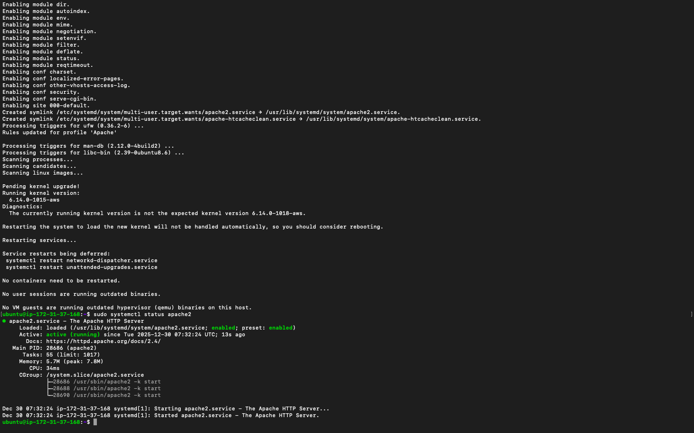
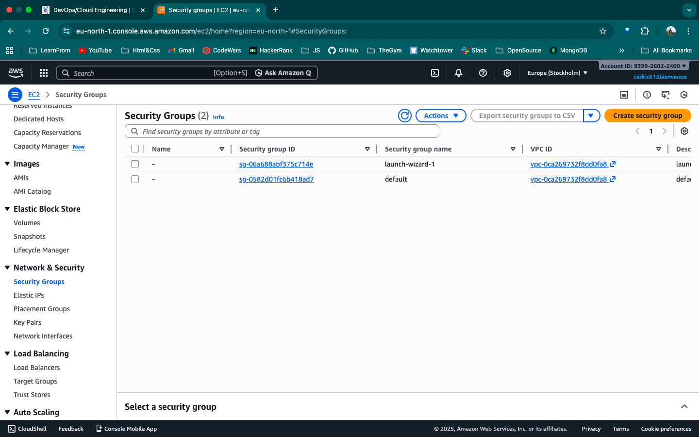
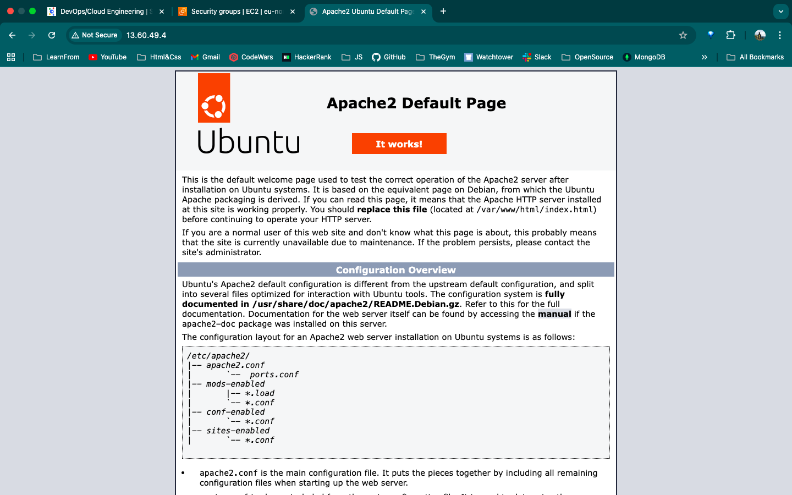
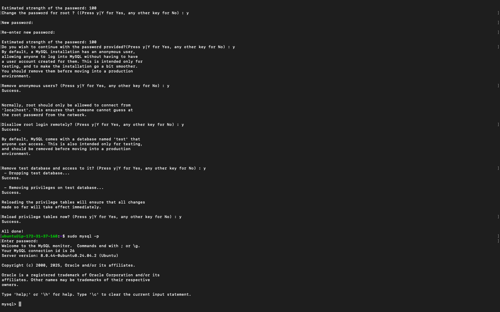
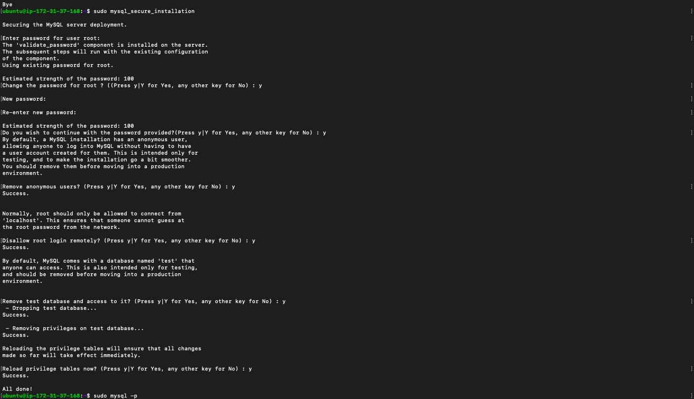
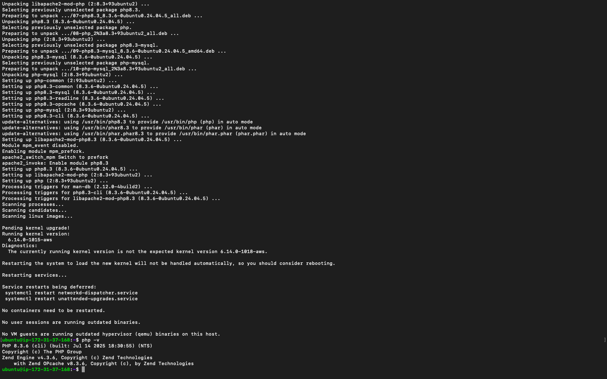
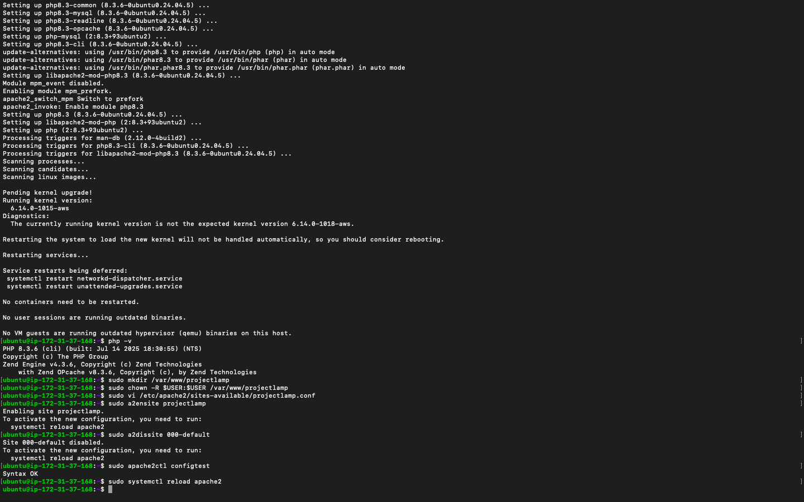
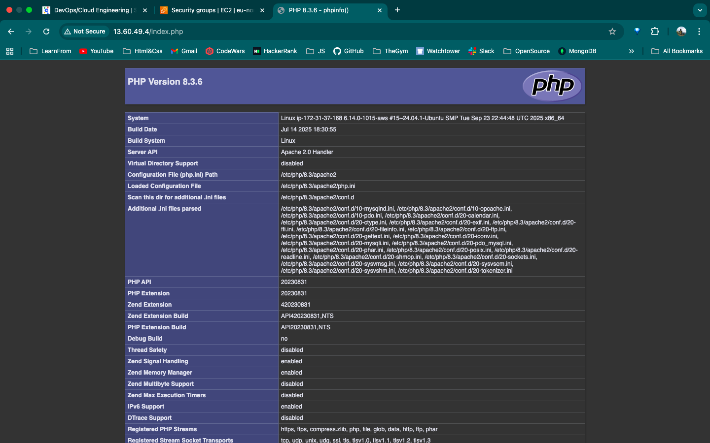

# Project: LAMP Stack Implementation on AWS

## Project Overview

This project involves the manual deployment and configuration of a **LAMP Stack** (Linux, Apache, MySQL, PHP) on a virtualized Amazon EC2 instance. This implementation focuses on granular administration of each layer, providing insight into infrastructure management, security group orchestration, and server-side scripting integration.

---

## Phase 1: Provisioning the Compute Engine (Linux & Apache)

The foundation of the stack is an EC2 Instance running **Ubuntu 24.04 LTS**. Apache serves as the web server, responsible for listening to incoming HTTP requests and serving content to client browsers.

### 1.1 Installation and Service Management

To prepare the environment, synchronize the local package index with global Ubuntu repositories before installing the Apache service:

- **Update package list**

  ```bash
  sudo apt update
  ```

- **Install Apache**

  ```bash
  sudo apt install apache2
  ```

- **Verify service status**

  ```bash
  sudo systemctl status apache2
  ```

> **Expected Output:** The terminal should display a green indicator and the text **"Active: active (running)"**.
> 

1.2 Networking and Verification

Configure Security Group: Open Port 80 (HTTP) to 0.0.0.0/0 in the AWS EC2 Security Group.

> 

- **Public IP Access:** Navigate to the following URL in your browser:

  ```text
  http://<YOUR_PUBLIC_IP>:80
  ```

> **Web Preview:** The **Apache2 Ubuntu Default Page** with the red header **"It works!"** should appear.
> 

---

## Phase 2: Data Persistence Layer (MySQL)

A relational database is required to store application data such as user records and state information.

### 2.1 Installation

- **Install MySQL Server**

  ```bash
  sudo apt install mysql-server
  ```

- **Access MySQL Shell**

  ```bash
  sudo mysql
  ```

> **Expected Output:** The MySQL administrative prompt `mysql>` should appear.
> 

### 2.2 Security Hardening

Run MySQL's built-in security script to remove insecure defaults:

```bash
sudo mysql_secure_installation
```

> **Expected Output:** After completing the prompts, the script should finish with **"Success. All done!"**.
> 

---

## Phase 3: Application Layer (PHP)

PHP enables dynamic content generation and communication between Apache and MySQL.

### 3.1 Installation

- **Install PHP and required modules**

  ```bash
  sudo apt install php libapache2-mod-php php-mysql
  ```

- **Verify PHP installation**

  ```bash
  php -v
  ```

> **Expected Output:** PHP version information such as **"PHP 8.3.6 (cli)"** should be displayed.
> 

---

## Phase 4: Virtual Hosting and Root Directory Encapsulation

To follow best practices, application files are served from a custom directory instead of `/var/www/html`.

### 4.1 Custom Web Root Setup

- **Create project directory**

  ```bash
  sudo mkdir /var/www/projectlamp
  ```

- **Assign ownership**

  ```bash
  sudo chown -R $USER:$USER /var/www/projectlamp
  ```

- **Create Apache virtual host configuration**

  ```bash
  sudo vi /etc/apache2/sites-available/projectlamp.conf
  ```

### 4.2 Activation and Syntax Check

- **Enable the new virtual host**

  ```bash
  sudo a2ensite projectlamp
  ```

- **Disable default site**

  ```bash
  sudo a2dissite 000-default
  ```

- **Test Apache configuration syntax**

  ```bash
  sudo apache2ctl configtest
  ```

- **Reload Apache**

  ```bash
  sudo systemctl reload apache2
  ```

> **Expected Output:** The syntax check should return **"Syntax OK"**.
>  >

**Web Preview:** Requests to `http://<YOUR_PUBLIC_IP>:80` will now serve content from `/var/www/projectlamp`.

> 

---

## Phase 5: Final Validation and Precedence

Apache determines which index file to load based on priority. The file `/etc/apache2/mods-enabled/dir.conf` is adjusted to prioritize `index.php`.

### 5.1 PHP Diagnostic Test

Create a PHP diagnostic file to validate PHP processing:

- **Create test file**

  ```bash
  vi /var/www/projectlamp/index.php
  ```

  ```php
  <?php phpinfo(); ?>
  ```

  > 

- **Access via browser**

  ```text
  http://<YOUR_PUBLIC_IP>:80/index.php
  ```

> **Web Preview:** The purple **PHP Version Information Page** should be displayed.
> 

---

## Conclusion and Cleanup

The LAMP stack is now fully operational on AWS EC2. To prevent exposure of sensitive configuration details, remove the diagnostic file:

```bash
sudo rm /var/www/projectlamp/index.php
```

---
